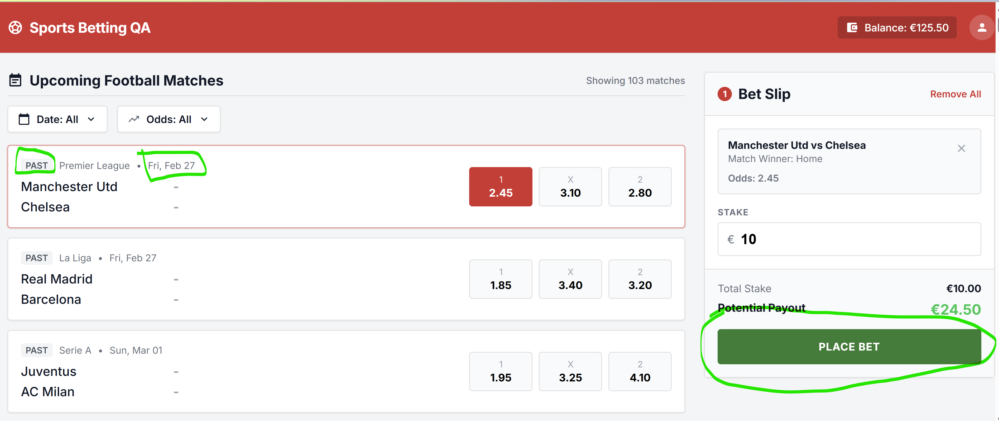
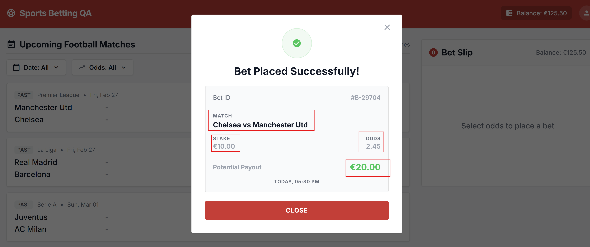
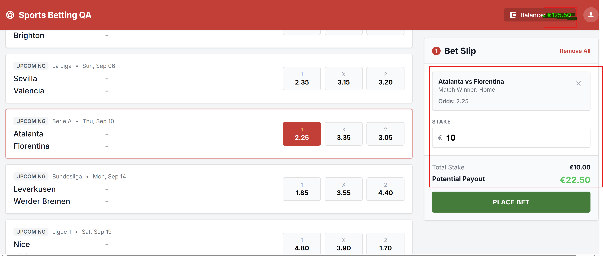
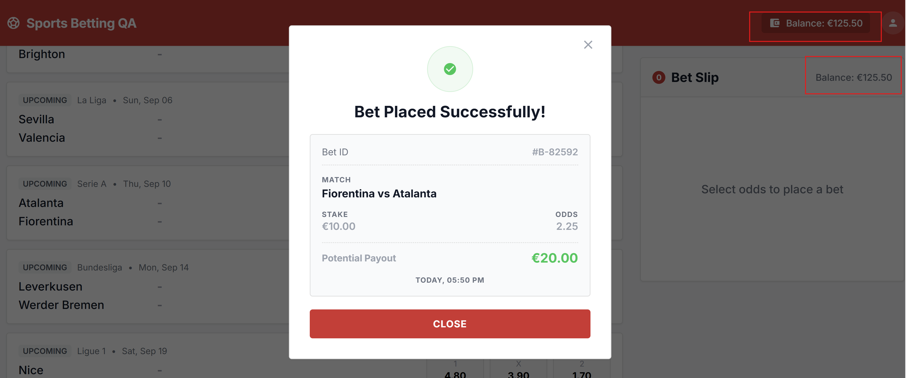
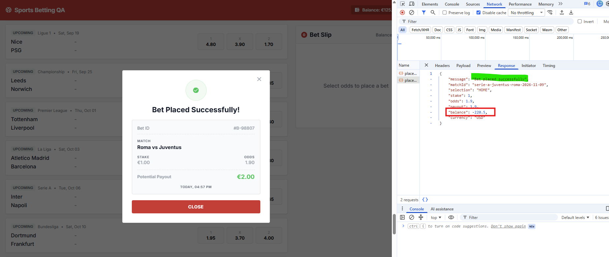

# Bug Report

## Test ran
| Test ID | Status | Note  |
| ------- | ------ | ----- |
| `01a`| **FAILED** | bug ticket ids: `02`, `03`, `05` |
|  `04`| **FAILED** | bug ticket id: `06` |
|  `05`| **FAILED** | bug ticket id `04` |
|  `07`| **FAILED** | bug ticket id `01` |

## 01 - User can place Bets on PAST matches
- `Severity`: Critical
- `Reproduction Steps`:
    1. Navigate to https://qae-assignment-tau.vercel.app/?user-id=<user_id>, replacing user_id with your user_id
    2. Look for a past match in the macth list
    3. Click on `1`, `2`, or `X`
    4. In the `Bet Slip` box, write a valid stake
    5. Click on `Place  Bet` button
- `Expected vs Actual result`: 
   - **Expected**: User can not place a bet for a past or live event.
   - **actual**: Past matches are being display an user can place a bet successfully
- `Business Impact`: User can bet on PAST events, knowing results, it could cause business to lose money, or if business works around it (asserting  bet placement date to be piror to match date before paying out and returning users funds) it will still be an extra cost for business and a bad image of the app for the users.  
- `Evidence`: 

## 02 - Success Receipt Modal shows wrong information
- `Severity`: High
- `Reproduction Steps`:
    1. Navigate to https://qae-assignment-tau.vercel.app/?user-id=<user_id>, replacing user_id with your user_id
    2. Look for an upcoming match in the macth list
    3. Click on `1`, `2`, or `X`
    4. In the `Bet Slip` box, write a valid stake, and take note of all the info shown (home vs away teams, odds, stake, selection, potential payout)
    5. Click on `Place  Bet` button
    6. Wait for the success receipt modal and compare info shown there with th eone collected in step 4.
- `Expected vs Actual result`: 
   - **Expected**: Same info is shown 
   - **actual**: 
       - Selection information missing (home, avawy, draw)
       - Match info is in format away vs home, instead of home vs away
       - Potential payout amount shown is wrong
       - Timestamp says "today" instead of the actual date
- `Business Impact`: It's just the reciept, it's not that the payout is being badly made, which would be a critical issue, but is still high, since it can cause a lot of confusion specially the potential payout aspect of it
- `Evidence`: 

## 03 - User balance is not being updated atuomatically after placing a bet
- `Severity`: High
- `Reproduction Steps`:
    1. Navigate to https://qae-assignment-tau.vercel.app/?user-id=<user_id>, replacing user_id with your user_id
    2. Look for an upcoming match in the macth list
    3. Click on `1`, `2`, or `X`
    4. Look at the Balance being shown in the header, take bnot of the amount shown
    4. In the `Bet Slip` box, write a valid stake
    5. Click on `Place  Bet` button
    6. Wait for the success receipt modal.
    7. Look at the Balance again, and the balance shown in the bet slip
- `Expected vs Actual result`: 
   - **Expected**: Balance is updated and shows ( prior balance - bet placed )
   - **actual**: Balance remains the same, it's only updated after reloading the page
- `Business Impact`: looking at API reponses the balance is actual being updated, it's just the UI that is not reflecting this, so it's not critical for business, but it's a really bad User experience
- `Evidence`: 

## 04 - User is able to place a bet with negative funds
- `Severity`: Critical
- `Reproduction Steps`:
    1. Navigate to https://qae-assignment-tau.vercel.app/?user-id=<user_id>, replacing user_id with your user_id
    2. Make sure you don't have enough funds to make a bet
    2. Look for an upcoming match in the macth list
    3. Click on `1`, `2`, or `X`
    4. In the `Bet Slip` box, write a valid stake, but for more money that you have in your funds
    5. Open dev tools and select the network tab
    5. Click on `Place  Bet` button
    6. Look at the place-bet POST request response
- `Expected vs Actual result`: 
   - **Expected**: User is not able to place a bet due lo lack of funds
   - **actual**: User is able to make bet with negative funds
- `Business Impact`: Money loss for business.
- `Evidence`: 

## 05 - Bet Slip - Missing available balance
- `Severity`: Low
- `Reproduction Steps`:
    1. Navigate to https://qae-assignment-tau.vercel.app/?user-id=<user_id>, replacing user_id with your user_id
    2. Look for an upcoming match in the macth list
    3. Click on `1`, `2`, or `X`
    4. In the `Bet Slip` box, write a valid stake
    5. Search for availabe balance info inside the `Bet Slip` box
- `Expected vs Actual result`: 
   - **Expected**: availabe balance info is being shown
   - **actual**:  No info about available balance
- `Business Impact`: this doesn't have a big impact is just some information missing for the user, and this info can be found in the header as well.
- `Evidence`: 

## 06 - User can place multiple bets on same match
- `Severity`: Critical
- `Reproduction Steps`:
    1. Navigate to https://qae-assignment-tau.vercel.app/?user-id=<user_id>, replacing user_id with your user_id
    2. Look for an upcoming match in the macth list
    3. Click on `1`, `2`, or `X`
    4. In the `Bet Slip` box, write a valid stake
    5. Click on `Place  Bet` button
    6. Close success receipt modal 
    7. repeat steps 2 to 5 for the same match
- `Expected vs Actual result`: 
   - **Expected**: User can not place 2 bets for same match 
   - **actual**:  Match that already has a bet made by user should not appear on the list, or `Place  Bet` button should be not clickable.
- `Business Impact`: 
- `Evidence`: 

## Exploratory testing:

- Medium: Date filter is not working properly on  boundaries (shows result for the day after. Look for matches from 11 to 13/08/2026 shows a match that is on 14/08/2026)
- To ask PM: Date filter: I don't understand what the "all" vs "Custom" option should be doing.
- Medium: Odds filter is just taking into account `1` odds for max, and `X` odds for min. 
- Low: "Showing XX matches" is not being updated when filtering
